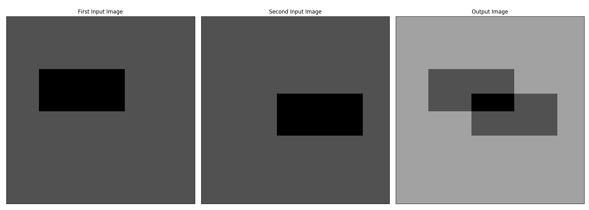
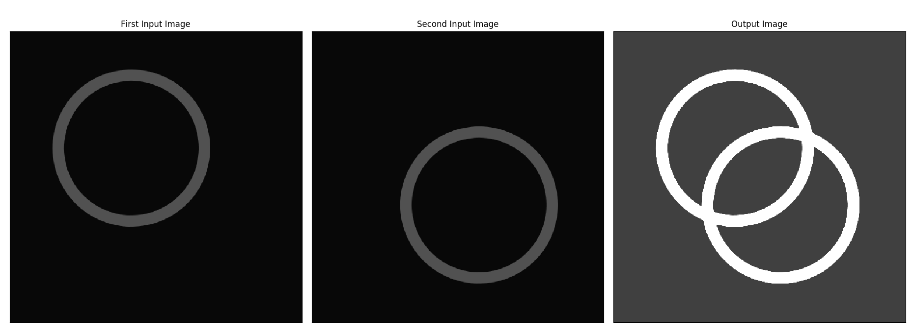
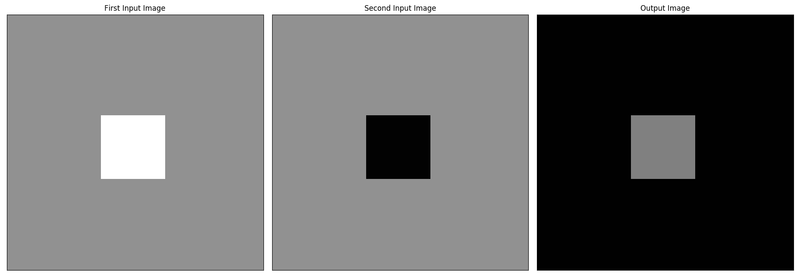
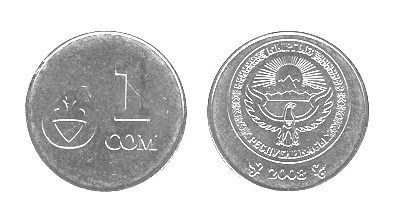

:Author:    Arafat Hasan
:Email:     <opendoor.arafat[at]gmail[dot]com>
:Date:      August 29, 2020
:Revision:  v1.0
:sectnums:
:toc: macro
:toc-title: Table of Content 
:toclevels: 3
:doctype: book

Image Processing Course
=======================

[[basic-operations-on-an-image]]
Basic Operations on an Image
----------------------------

[[what-we-will-know]]
What We Will Know
~~~~~~~~~~~~~~~~~

* Familiarize with IDE, environment.
* Read, write operations of an image.
* Basic image manipulation.
* Iterate over image pixels.
* Access image properties.
* Access pixel values and modify them.

Almost all the operations in this section is mainly related to `Numpy`
rather than `OpenCV`. A good knowledge of `Numpy` is required to write
better optimized code with `OpenCV`.

[[lets-code]]
Let's Code
~~~~~~~~~~

1.  Import python libraries for image processing and other stuffs.
+
[source,python]
-------------------------------------------------------------------------------
import cv2
import numpy as np
import os
-------------------------------------------------------------------------------
2.  Start main function and read image.
+
[source,python]
-------------------------------------------------------------------------------
if __name__ == '__main__':

    path = '../../img/misc/house.tiff'

    if os.path.isfile(path):
        img = cv2.imread(path)
        print("[INFO] Image has been read successfully...")
    else:
        print("[INFO] The file '" + path + "' does not exist.")
        sys.exit(0)
-------------------------------------------------------------------------------
3.  Show the image using OpenCV `imshow` method and write to disk a new
image using `imwrite` method.
+
[source,python]
-------------------------------------------------------------------------------
    cv2.imshow('Original', img)
    cv2.imwrite('NewHouseImage.png', img)
-------------------------------------------------------------------------------
4.  Access an arbitrary pixel and print it.
+
[source,python]
-------------------------------------------------------------------------------
    arbitraryPixel = img[2, 3]
    print('An arbitrary Pixel: ', arbitraryPixel)
-------------------------------------------------------------------------------
5.  Get image dimension, height, width, channels and print them and exit
window.
+
[source,python]
-------------------------------------------------------------------------------
    dimensions = img.shape
    height = img.shape[0]
    width = img.shape[1]
    channels = img.shape[2]

    print('Image Dimension: ', dimensions)
    print('Image Height: ', height)
    print('Image Width: ', width)
    print('Total Number of pixels :', img.size)

    k = cv2.waitKey(0)
    cv2.destroyAllWindows()

    print("[INFO] All operations finished successfully...")
-------------------------------------------------------------------------------

[[input-and-output]]
Input and Output
~~~~~~~~~~~~~~~~

[[image-output]]
Image Output
^^^^^^^^^^^^

image:imgOut/NewHouseImage.png[This image has been read,
written and shown.]

[[text-output]]
Text Output
^^^^^^^^^^^

....
[INFO] Image has been read successfully...
An arbitrary Pixel:  [211 222 218]
Image Dimension:  (512, 512, 3)
Image Height:  512
Image Width:  512
Total Number of pixels : 786432
[INFO] All operations finished successfully...
....

[[addition-of-two-images]]
Addition of Two Images
----------------------

[[what-we-will-know-1]]
What We Will Know
~~~~~~~~~~~~~~~~~

* Take two same sized image as input.
* Produce a third image with same size of the input image which pixels
are sum of two input images pixels.

Image addition equation is:

image:https://latex.codecogs.com/png.latex?g(x, y) = f_1(x, y) + f_2(x, y)[]

Here image:https://latex.codecogs.com/png.latex?f_1(x, y)[] and image:https://latex.codecogs.com/png.latex?f_2(x, y)[] are two input images
and image:https://latex.codecogs.com/png.latex?g(x, y)[] is output image.

[[lets-code-1]]
Let's Code
~~~~~~~~~~

1.  Import python libraries for image processing and other stuffs.
+
[source,python]
-------------------------------------------------------------------------------
import cv2
import numpy as np
from matplotlib import pyplot as plt
import os
import sys
-------------------------------------------------------------------------------
2.  Start main function and read images
+
[source,python]
-------------------------------------------------------------------------------
if __name__ == '__main__':
    path1 = '../../img/rectangle-1.png'
    path2 = '../../img/rectangle-2.png'

    if os.path.isfile(path1):
        img1 = cv2.imread(path1, cv2.IMREAD_GRAYSCALE)
        print("[INFO] First image has been read successfully...")
    else:
        print("[INFO] The file '" + path1 + "' does not exist.")
        sys.exit(0)

    if os.path.isfile(path2):
        img2 = cv2.imread(path2, cv2.IMREAD_GRAYSCALE)
        print("[INFO] Second image has been read successfully...")
    else:
        print("[INFO] The file '" + path2 + "' does not exist.")
        sys.exit(0)
-------------------------------------------------------------------------------
3.  Check whether input images are in identical size, if not then resize
one of them. Image ratio may change. Better use same sized image.
+
[source,python]
-------------------------------------------------------------------------------
    if img1.shape != img2.shape:
        print("Image sizes are not identical, resizing second image.")
        img2 = cv2.resize(img2, img1.shape[1], img1.shape[2])
-------------------------------------------------------------------------------
4.  Get image size and create a blank image as output.
+
[source,python]
-------------------------------------------------------------------------------
    rows, cols = img1.shape
    output = np.zeros((rows, cols), dtype='uint8')
-------------------------------------------------------------------------------
5.  Iterate over the pixels and add individual pixel to get output.
+
[source,python]
-------------------------------------------------------------------------------
    for row in range(rows):
        for col in range(cols):
            tmp = int(img1[row, col]) + int(img2[row, col])
            output[row, col] = max(0, min(tmp, 255))
-------------------------------------------------------------------------------
6.  Plot two input images and an output image as addition result.
+
[source,python]
-------------------------------------------------------------------------------
    titles = ['First Input Image', 'Second Input Image', 'Output Image']
    imgarr = [img1, img2, output]
    for i in range(3):
        plt.subplot(1, 3, i + 1)
        plt.imshow(imgarr[i], cmap='gray', vmin=0, vmax=255)
        plt.title(titles[i])
        plt.xticks([])
        plt.yticks([])

    plt.show()

    print("[INFO] All operations finished successfully...")
-------------------------------------------------------------------------------

[[input-and-output-1]]
Input and Output
~~~~~~~~~~~~~~~~

[[image-output-1]]
Image Output
^^^^^^^^^^^^

[[text-output-1]]
Text Output
^^^^^^^^^^^

....
[INFO] First image has been read successfully...
[INFO] Second image has been read successfully...
[INFO] All operations finished successfully...
....

[[multiplication-of-two-images]]
Multiplication of Two Images
----------------------------

[[what-we-will-know-2]]
What We Will Know
~~~~~~~~~~~~~~~~~

Take two input image and multiply them and generate new output image.
The multiplication of two images is performed in the obvious way in a
single pass using the formula:
image:https://latex.codecogs.com/png.latex?Q(i, j) = P_1(i, j) \times P_2(i, j)[]

[[lets-code-2]]
Let's Code
~~~~~~~~~~

1.  Import python libraries for image processing and other stuffs.
+
[source,python]
-------------------------------------------------------------------------------
import cv2
import numpy as np
from matplotlib import pyplot as plt
import os
import sys
-------------------------------------------------------------------------------
2.  Start main code section and read images.
+
[source,python]
-------------------------------------------------------------------------------
if __name__ == '__main__':
    path1 = '../../img/circle-1.png'
    path2 = '../../img/circle-2.png'

    if os.path.isfile(path1):
        img1 = cv2.imread(path1, cv2.IMREAD_GRAYSCALE)
        print("[INFO] First image has been read successfully...")
    else:
        print("[INFO] The file '" + path1 + "' does not exist.")
        sys.exit(0)

    if os.path.isfile(path2):
        img2 = cv2.imread(path2, cv2.IMREAD_GRAYSCALE)
        print("[INFO] Second image has been read successfully...")
    else:
        print("[INFO] The file '" + path2 + "' does not exist.")
        sys.exit(0)
-------------------------------------------------------------------------------
3.  Check whether input images are in identical size.
+
[source,python]
-------------------------------------------------------------------------------
    if img1.shape != img2.shape:
        print("[INFO] Image sizes are not identical, resizing second image.")
        img2 = cv2.resize(img2, img1.shape[1], img1.shape[2])
-------------------------------------------------------------------------------
4.  Ceate a blank output image and convert input images form
image:https://latex.codecogs.com/png.latex?uint8[] to image:https://latex.codecogs.com/png.latex?float[] to encounter overflow problem
with image:https://latex.codecogs.com/png.latex?uint8[].
+
[source,python]
-------------------------------------------------------------------------------
    rows, cols = img1.shape
    output = np.zeros((rows, cols), dtype='float')
    img1 = img1.astype(float)
    img2 = img2.astype(float)
-------------------------------------------------------------------------------
5.  Iterate over every pixel and multiply input image’s pixel to get
output pixels.
+
[source,python]
-------------------------------------------------------------------------------
    for row in range(rows):
        for col in range(cols):
            tmp = img1[row, col] * img2[row, col]
            output[row, col] = max(0, min(tmp, 255))
-------------------------------------------------------------------------------
6.  Plot two input images and result image’s using
image:https://latex.codecogs.com/png.latex?matplotlib[].
+
[source,python]
-------------------------------------------------------------------------------
    titles = ['First Input Image', 'Second Input Image', 'Output Image']
    imgarr = [img1, img2, output]
    for i in range(3):
        plt.subplot(1, 3, i + 1)
        plt.imshow(imgarr[i], cmap='gray', vmin=0, vmax=255)
        plt.title(titles[i])
        plt.xticks([])
        plt.yticks([])

    plt.show()

    print("[INFO] All operations finished successfully...")
-------------------------------------------------------------------------------

[[input-and-output-2]]
Input and Output
~~~~~~~~~~~~~~~~

[[image-output-2]]
Image Output
^^^^^^^^^^^^

[[text-output-2]]
Text Output
^^^^^^^^^^^

....
[INFO] First image has been read successfully...
[INFO] Second image has been read successfully...
[INFO] All operations finished successfully...
....

[[division-of-two-images]]
Division of Two Images
----------------------

[[what-we-will-know-3]]
What We Will Know
~~~~~~~~~~~~~~~~~

Take two input image and divide one by another and generate new output
image. The division of two images is performed in the obvious way in a
single pass using the formula:
image:https://latex.codecogs.com/png.latex?Q(i, j) = P_1(i, j) \div P_2(i, j)[]

[[lets-code-3]]
Let's Code
~~~~~~~~~~

1.  Import python libraries for image processing and other stuffs.
+
[source,python]
-------------------------------------------------------------------------------
import cv2
import numpy as np
from matplotlib import pyplot as plt
import math
import os
import sys
-------------------------------------------------------------------------------
2.  Start main code section and read images.
+
[source,python]
-------------------------------------------------------------------------------
if __name__ == '__main__':
    path1 = '../../img/rectangle-div-1.png'
    path2 = '../../img/rectangle-div-2.png'

    if os.path.isfile(path1):
        img1 = cv2.imread(path1, cv2.IMREAD_GRAYSCALE)
        print("[INFO] First image has been read successfully...")
    else:
        print("[INFO] The file '" + path1 + "' does not exist.")
        sys.exit(0)

    if os.path.isfile(path2):
        img2 = cv2.imread(path2, cv2.IMREAD_GRAYSCALE)
        print("[INFO] Second image has been read successfully...")
    else:
        print("[INFO] The file '" + path2 + "' does not exist.")
        sys.exit(0)
-------------------------------------------------------------------------------
3.  Check whether input images are in identical size.
+
[source,python]
-------------------------------------------------------------------------------
    if img1.shape != img2.shape:
        print("Image sizes are not identical, resizing second image.")
        img2 = cv2.resize(img2, img1.shape[1], img1.shape[2])
-------------------------------------------------------------------------------
4.  Ceate a blank output image and convert input images form
image:https://latex.codecogs.com/png.latex?uint8[] to image:https://latex.codecogs.com/png.latex?float[] to encounter overflow problem
with image:https://latex.codecogs.com/png.latex?uint8[].
+
[source,python]
-------------------------------------------------------------------------------
    rows, cols = img1.shape
    output = np.zeros((rows, cols), dtype='float')
    img1 = img1.astype(float)
    img2 = img2.astype(float)
-------------------------------------------------------------------------------
5.  Iterate over every pixel and divide input image’s pixels to get
output pixels.
+
[source,python]
-------------------------------------------------------------------------------
    for row in range(rows):
        for col in range(cols):
            if img2[row, col] != 0:
                tmp = math.ceil(img1[row, col] / img2[row, col])
            else:  # division by zero wiil generate a huge number, here 255 is that huge
                tmp = 255
            output[row, col] = max(0, min(tmp, 255))
-------------------------------------------------------------------------------
6.  Plot two input images and result image’s using
image:https://latex.codecogs.com/png.latex?matplotlib[].
+
[source,python]
-------------------------------------------------------------------------------
    titles = ['First Input Image', 'Second Input Image', 'Output Image']
    imgarr = [img1, img2, output]
    for i in range(3):
        plt.subplot(1, 3, i + 1)
        plt.imshow(imgarr[i], cmap='gray', vmin=0, vmax=255)
        plt.title(titles[i])
        plt.xticks([])
        plt.yticks([])

    plt.show()

    print("[INFO] All operations finished successfully...")
-------------------------------------------------------------------------------

[[input-and-output-3]]
Input and Output
~~~~~~~~~~~~~~~~

[[image-output-3]]
Image Output
^^^^^^^^^^^^

[[text-output-3]]
Text Output
^^^^^^^^^^^

....
[INFO] First image has been read successfully...
[INFO] Second image has been read successfully...
[INFO] All operations finished successfully...
....

[[brightness-increasing-and-calculation]]
Brightness Increasing and Calculation
-------------------------------------

[[what-we-will-know-4]]
What We Will Know
~~~~~~~~~~~~~~~~~

Brightness is one of the most significant pixel characteristics. It is
involved in many image-editing algorithms such as contrast or
shadow/highlight.

* Brightness calculation
* Increase brightness of an image

Brightness calculation formula is:

image:https://latex.codecogs.com/png.latex?B = \frac{\sum_{M,\ N}{I(m, n)}}{M \times N}[]

In this equation, M and N are the number of rows and columns in the
input images. To increase/decrease brightness level of the image, simply
add/subtract a constant positive value to each and every image pixel.

image:https://latex.codecogs.com/png.latex?Image_{new}(m, n) = Image_{old}(m, n) \pm BrightnessConstant[]

[[lets-code-4]]
Let's Code
~~~~~~~~~~

1.  Import python libraries for image processing and other stuffs.
+
[source,python]
-------------------------------------------------------------------------------
import cv2
import numpy as np
from matplotlib import pyplot as plt
import os
-------------------------------------------------------------------------------
2.  Start main code section and read image.
+
[source,python]
-------------------------------------------------------------------------------
if __name__ == '__main__':
    path = '../../img/lennaGray.png'

    if os.path.isfile(path):
        img = cv2.imread(path, cv2.IMREAD_GRAYSCALE)
        print("[INFO] Image has been read successfully...")
    else:
        print("[INFO] The file '" + path + "' does not exist.")
        sys.exit(0)
-------------------------------------------------------------------------------
3.  Get input image size and create a blank image and set a brightness
constant.
+
[source,python]
-------------------------------------------------------------------------------
    rows, cols = img.shape
    output = np.zeros((rows, cols), dtype='float')
    img = img.astype(float)  # To get rid of from overflow
    brightnessConstant = 70
-------------------------------------------------------------------------------
4.  Iterate over all pixels and decrease intensity of each pixel and
bond the pixels in range image:https://latex.codecogs.com/png.latex?[0, 255][].
+
[source,python]
-------------------------------------------------------------------------------
    for row in range(rows):
        for col in range(cols):
            tmp = img[row, col] - brightnessConstant
            output[row, col] = max(0, min(tmp, 255))
-------------------------------------------------------------------------------
5.  A more pythonic way to do the previous step is written here as
comment. No need to iterate over pixels, python and numpy do the stuffs
for us.
+
[source,python]
-------------------------------------------------------------------------------
    # This is more pythonic way for changing  brightness
    # output = img - brightnessConstant  # No need to iterate over every pixel
    # lowerbound, upperbound = 0, 255
    # np.clip(output, lowerbound, upperbound, out=output)  # Numpy do the bounding
-------------------------------------------------------------------------------
6.  Print original calculated brightness and changed brightness.
+
[source,python]
-------------------------------------------------------------------------------
    print('Original Brightness: ', np.mean(img))
    print('Changed Brightness: ', np.mean(output))
-------------------------------------------------------------------------------
7.  Plot main input image and brightness changed image.
+
[source,python]
-------------------------------------------------------------------------------
    titles = ['Original Brightness', 'Changed Brightness']
    imgarr = [img, output]
    for i in range(2):
        plt.subplot(1, 2, i + 1)
        plt.imshow(imgarr[i], cmap='gray', vmin = 0, vmax = 255)
        plt.title(titles[i])
        plt.xticks([])
        plt.yticks([])

    plt.show()

    print("[INFO] All operations finished successfully...")
-------------------------------------------------------------------------------

[[input-and-output-4]]
Input and Output
~~~~~~~~~~~~~~~~

[[image-output-4]]
Image Output
^^^^^^^^^^^^

image:imgOut/brightness.png[Change in brightness on Lenna’s
image.]

[[text-output-4]]
Text Output
^^^^^^^^^^^

....
[INFO] Image has been read successfully...
Original Brightness:  123.54518127441406
Changed Brightness:  57.06407165527344
[INFO] All operations finished successfully...
....

[[image-contrast-changing-and-calculation]]
Image Contrast Changing and Calculation
---------------------------------------

[[what-we-will-know-5]]
What We Will Know
~~~~~~~~~~~~~~~~~

Contrast is the difference in luminance or color that makes an object
(or its representation in an image or display) distinguishable. Contrast
can be simply explained as the difference between maximum and minimum
pixel intensity in an image.

What We Will Know of this experiment is to:

* Increase the contrast of an image.
* Calculate contrast of an image.

Contrast calculation formula:
image:https://latex.codecogs.com/png.latex?Contrast= Maximum\ pixel\ intensity - Minimum\ pixel\ intensity[]

[[lets-code-5]]
Let's Code
~~~~~~~~~~

1.  Import python libraries for image processing and other stuffs.
+
[source,python]
-------------------------------------------------------------------------------
import cv2
import numpy as np
from matplotlib import pyplot as plt
import os
-------------------------------------------------------------------------------
2.  Start main code section and read image.
+
[source,python]
-------------------------------------------------------------------------------
if __name__ == '__main__':
    path = '../../img/misc/7.1.01.tiff'

    if os.path.isfile(path):
        img = cv2.imread(path, cv2.IMREAD_GRAYSCALE)
        print("[INFO] Image has been read successfully...")
    else:
        print("[INFO] The file '" + path + "' does not exist.")
        sys.exit(0)
-------------------------------------------------------------------------------
3.  Get input image size and create a blank image and set a contrast
constant.
+
[source,python]
-------------------------------------------------------------------------------
    rows, cols = img.shape
    output = np.zeros((rows, cols), dtype='float')
    img = img.astype(float)  # To get rid of from overflow
    contrastConstant = 1.7
-------------------------------------------------------------------------------
4.  Iterate over all pixels and multiply the constant with each pixel
and bond the pixels in range image:https://latex.codecogs.com/png.latex?[0, 255][].
+
[source,python]
-------------------------------------------------------------------------------
    for row in range(rows):
        for col in range(cols):
            tmp = img[row, col] * contrastConstant
            output[row, col] = max(0, min(tmp, 255))
-------------------------------------------------------------------------------
5.  A more pythonic way to do the previous step is written here as
comment. No need to iterate over pixels, python and numpy do the stuffs
for us.
+
[source,python]
-------------------------------------------------------------------------------
    # This is more pythonic way for changing  brightness
    # output = img * contrastConstant  # No need to iterate over every pixel
    # lowerbound, upperbound = 0, 255
    # np.clip(output, lowerbound, upperbound, out=output)  # Numpy do the bounding
-------------------------------------------------------------------------------
6.  Print original calculated contrast and changed contrast.
+
[source,python]
-------------------------------------------------------------------------------
    print('Original Contrast: ', np.amax(img) - np.amin(img))
    print('Increased Contrast: ', np.amax(output) - np.amin(output))
-------------------------------------------------------------------------------
7.  Plot main input image and contrast changed image.
+
[source,python]
-------------------------------------------------------------------------------
    titles = ['Original Contrast', 'Increased Contrast']
    imgarr = [img, output]
    for i in range(2):
        plt.subplot(1, 2, i + 1)
        plt.imshow(imgarr[i], cmap='gray', vmin=0, vmax=255)
        plt.title(titles[i])
        plt.xticks([])
        plt.yticks([])

    plt.show()

    print("[INFO] All operations finished successfully...")
-------------------------------------------------------------------------------

[[input-and-output-5]]
Input and Output
~~~~~~~~~~~~~~~~

[[image-output-5]]
Image Output
^^^^^^^^^^^^

image:imgOut/contrast.png[Change in contrast on a desert
image.]

[[text-output-5]]
Text Output
^^^^^^^^^^^

....
[INFO] Image has been read successfully...
Original Contrast:  247.0
Increased Contrast:  249.9
[INFO] All operations finished successfully...
....

[[reading-and-writing-of-color-image]]
Reading and Writing of Color Image
----------------------------------

[[what-we-will-know-6]]
What We Will Know
~~~~~~~~~~~~~~~~~

* Familiarize with IDE, environment.
* Read, write operations of an image.
* Basic image manipulation.
* Iterate over image pixels.
* Access image properties.
* Access pixel values and modify them.

Almost all the operations in this section is mainly related to `Numpy`
rather than `OpenCV`. A good knowledge of `Numpy` is required to write
better optimized code with `OpenCV`.

[[lets-code-6]]
Let's Code
~~~~~~~~~~

1.  Import python libraries for image processing and other stuffs.
+
[source,python]
-------------------------------------------------------------------------------
import cv2
import numpy as np
import os
-------------------------------------------------------------------------------
2.  Start main function and read image.
+
[source,python]
-------------------------------------------------------------------------------
if __name__ == '__main__':

    path = '../../img/misc/house.tiff'

    if os.path.isfile(path):
        img = cv2.imread(path)
        print("[INFO] Image has been read successfully...")
    else:
        print("[INFO] The file '" + path + "' does not exist.")
        sys.exit(0)
-------------------------------------------------------------------------------
3.  Show the image using OpenCV `imshow` method and write to disk a new
image using `imwrite` method.
+
[source,python]
-------------------------------------------------------------------------------
    cv2.imshow('Original', img)
    cv2.imwrite('NewHouseImage.png', img)
-------------------------------------------------------------------------------
4.  Access an arbitrary pixel and print it.
+
[source,python]
-------------------------------------------------------------------------------
    arbitraryPixel = img[2, 3]
    print('An arbitrary Pixel: ', arbitraryPixel)
-------------------------------------------------------------------------------
5.  Get image dimension, height, width, channels and print them and exit
window.
+
[source,python]
-------------------------------------------------------------------------------
    dimensions = img.shape
    height = img.shape[0]
    width = img.shape[1]
    channels = img.shape[2]

    print('Image Dimension: ', dimensions)
    print('Image Height: ', height)
    print('Image Width: ', width)
    print('Total Number of pixels :', img.size)

    k = cv2.waitKey(0)
    cv2.destroyAllWindows()

    print("[INFO] All operations finished successfully...")
-------------------------------------------------------------------------------

[[input-and-output-6]]
Input and Output
~~~~~~~~~~~~~~~~

[[image-output-6]]
Image Output
^^^^^^^^^^^^

image:imgOut/NewHouseImage.png[This image has been read,
written and shown.]

[[text-output-6]]
Text Output
^^^^^^^^^^^

....
[INFO] Image has been read successfully...
An arbitrary Pixel:  [211 222 218]
Image Dimension:  (512, 512, 3)
Image Height:  512
Image Width:  512
Total Number of pixels : 786432
[INFO] All operations finished successfully...
....

[[grayscale-and-binary-conversion]]
Grayscale and Binary Conversion
-------------------------------

[[what-we-will-know-7]]
What We Will Know
~~~~~~~~~~~~~~~~~

An RGB image can be viewed as three different images(a red scale image,
a green scale image and a blue scale image) stacked on top of each
other, and when fed into the red, green and blue inputs of a color
monitor, it produces a color image on the screen.

An RGB image is sometimes referred to as a true color image as the
precision with which a real-life image can be replicated has led to the
nickname _true color image_.

[[grayscale-conversion]]
Grayscale Conversion
^^^^^^^^^^^^^^^^^^^^

There are two methods to convert an color image into a grayscale image.
Both has their own merits and demerits. The methods are:

* Average method
* Weighted method or luminosity method

[[average-method]]
Average method
++++++++++++++

Average method is the most simple one. You just have to take the average
of three colors. Since its an RGB image, so it means that you have add r
with g with b and then divide it by 3 to get your desired grayscale
image.

Its done in this way.

image:https://latex.codecogs.com/png.latex?Grayscale = (R + G + B / 3)[]

[[weighted-method-or-luminosity-method]]
Weighted method or luminosity method
++++++++++++++++++++++++++++++++++++

Since red color has more wavelength of all the three colors, and green
is the color that has not only less wavelength then red color but also
green is the color that gives more soothing effect to the eyes.

It means that we have to decrease the contribution of red color, and
increase the contribution of the green color, and put blue color
contribution in between these two.

So the new equation that form is:

image:https://latex.codecogs.com/png.latex?New \ grayscale \ image = ( (0.299 \times R) + (0.587 \times G) + (0.144 \times B) ).[]

According to this equation, Red has contribute 30%, Green has
contributed 59% which is greater in all three colors and Blue has
contributed 11%.

[[binary-conversion]]
Binary Conversion
^^^^^^^^^^^^^^^^^

To convert RGB image to Binary image, we have to the RGB image into
Grayscale image first. Then we set threshold value. Then we use this
equation :

image:https://latex.codecogs.com/png.latex?y=
   \begin{cases}
     1, & \text{if}\ y \geq threshhold \\
     0, & \text{otherwise}
   \end{cases}[]

[[lets-code-7]]
Let's Code
~~~~~~~~~~

1.  Import python libraries for image processing and other stuffs.
+
[source,python]
-------------------------------------------------------------------------------
import cv2
import math
import numpy as np
import matplotlib.pyplot as plt
import os
-------------------------------------------------------------------------------
2.  Start main code section and read image.
+
[source,python]
-------------------------------------------------------------------------------
if __name__ == '__main__':

    path = '../../img/misc/4.1.08.tiff'

    if os.path.isfile(path):
        img = cv2.imread(path)
        img = cv2.cvtColor(img, cv2.COLOR_BGR2RGB)
        print("[INFO] Image has been read successfully...")
    else:
        print("[INFO] The file '" + path + "' does not exist.")
        sys.exit(0)
-------------------------------------------------------------------------------
3.  Get input image size and create two grayscale and a binary dump
image of that size. Set thresh value.
+
[source,python]
-------------------------------------------------------------------------------
    rows, cols, ch = img.shape
    img = img.astype('float')
    imgGraygen = np.zeros((rows, cols), dtype='uint8')
    imgGrayweighted = np.zeros((rows, cols), dtype='uint8')
    imgBinary = np.zeros((rows, cols), dtype='bool_')
    thresh = 170
-------------------------------------------------------------------------------
4.  Iterate over pixels and calculate average, weighted average and get
binary intensity based on range.
+
[source,python]
-------------------------------------------------------------------------------
    for row in range(rows):
        for col in range(cols):
            pixel = img[row, col]
            avggen = int(math.ceil(pixel[0] + pixel[1] + pixel[2]) / 3)
            avgweighted = int(
                math.ceil(pixel[0] * 0.299 + pixel[1] * 0.587 +
                          pixel[2] * 0.144))
            imgGraygen[row, col] = max(0, min(avggen, 255))
            imgGrayweighted[row, col] = max(0, min(avgweighted, 255))
            imgBinary[row, col] = False if avgweighted > thresh else True
-------------------------------------------------------------------------------
5.  Convert to binary image using OpenCV library, given as comment.
+
[source,python]
-------------------------------------------------------------------------------
    # ======================================================
    # IMPLEMENTATION USING OPENCV LIBRARY
    # ======================================================
    # (thresh, imgBinary) = cv2.threshold(imgGrayweighted, 128, 255, cv2.THRESH_BINARY | cv2.THRESH_OTSU)
-------------------------------------------------------------------------------
6.  Show main image, grayscale images and binary image using
`matplotlib.pyplot`.
+
[source,python]
-------------------------------------------------------------------------------
    titles = [
        'Original Image', 'Average Grayscale Image', 'Weighted Grayscale Image',
        'Binary Image'
    ]
    imgarr = [img, imgGraygen, imgGrayweighted, imgBinary]

    plt.subplot(1, 4, 1)
    plt.imshow(np.uint8(imgarr[0]))
    plt.title(titles[0])
    plt.xticks([])
    plt.yticks([])

    plt.subplot(1, 4, 2)
    plt.imshow(imgarr[1], cmap='gray', vmin=0, vmax=255)
    plt.title(titles[1])
    plt.xticks([])
    plt.yticks([])

    plt.subplot(1, 4, 3)
    plt.imshow(imgarr[2], cmap='gray', vmin=0, vmax=255)
    plt.title(titles[2])
    plt.xticks([])
    plt.yticks([])

    plt.subplot(1, 4, 4)
    plt.imshow(imgarr[3], cmap='binary')
    plt.title(titles[3])
    plt.xticks([])
    plt.yticks([])
    plt.show()

    print("[INFO] All operations finished successfully...")
-------------------------------------------------------------------------------

[[input-and-output-7]]
Input and Output
~~~~~~~~~~~~~~~~

[[image-output-7]]
Image Output
^^^^^^^^^^^^

image:imgOut/RGB-to-gray-and-binary.png[RGB to grayscale
and binary conversion.]

[[text-output-7]]
Text Output
^^^^^^^^^^^

....
[INFO] Image has been read successfully...
[INFO] All operations finished successfully...
....

[[negative-transformation]]
Negative Transformation
-----------------------

[[what-we-will-know-8]]
What We Will Know
~~~~~~~~~~~~~~~~~

Black and white image inversion refers to an image processing technique
where light areas are mapped to dark, and dark areas are mapped to
light. In other words, after image inversion black becomes white and
white becomes black. An inverted black and white image can be thought of
as a digital negative of the original image.

This is particularly useful for enhancing white or gray details embedded
in dark regions of an image.

image:https://latex.codecogs.com/png.latex?I_{inverted}(x, y) = 255 - I(x, y)[]

[[lets-code-8]]
Let's Code
~~~~~~~~~~

1.  Import python libraries for image processing and other stuffs.
+
[source,python]
-------------------------------------------------------------------------------
import cv2
import numpy as np
from matplotlib import pyplot as plt
import os
import sys
-------------------------------------------------------------------------------
2.  Start main code section and read image.
+
[source,python]
-------------------------------------------------------------------------------
if __name__ == '__main__':
    path = '../../img/pollen-image-plants.jpg'

    if os.path.isfile(path):
        img = cv2.imread(path, cv2.IMREAD_GRAYSCALE)
        print("[INFO] Image has been read successfully...")
    else:
        print("[INFO] The file '" + path + "' does not exist.")
        sys.exit(0)
-------------------------------------------------------------------------------
3.  Get input image size and create a blank image identical in size with
input image.
+
[source,python]
-------------------------------------------------------------------------------
    rows, cols = img.shape
    output = np.zeros((rows, cols), dtype='uint8')
-------------------------------------------------------------------------------
4.  Iterate over every pixel and apply the negation equation to
determine output pixel.
+
[source,python]
-------------------------------------------------------------------------------
    for row in range(rows):
        for col in range(cols):
            output[row, col] = 255 - img[row, col]
-------------------------------------------------------------------------------
5.  Plot input image and result output image using
image:https://latex.codecogs.com/png.latex?matplotlib[].
+
[source,python]
-------------------------------------------------------------------------------
    titles = ['Input Image', 'Negative Image']
    imgarr = [img, output]
    for i in range(2):
        plt.subplot(1, 2, i + 1)
        plt.imshow(imgarr[i], cmap='gray', vmin=0, vmax=255)
        plt.title(titles[i])
        plt.xticks([])
        plt.yticks([])

    plt.show()

    print("[INFO] All operations finished successfully...")
-------------------------------------------------------------------------------

[[input-and-output-8]]
Input and Output
~~~~~~~~~~~~~~~~

[[image-output-8]]
Image Output
^^^^^^^^^^^^

image:imgOut/negation.png[Negative Transformation over
pollen image to enhance details.]

[[text-output-8]]
Text Output
^^^^^^^^^^^

....
[INFO] Image has been read successfully...
[INFO] All operations finished successfully...
....

[[alpha-blending]]
Alpha Blending
--------------

[[what-we-will-know-9]]
What We Will Know
~~~~~~~~~~~~~~~~~

Alpha blending is the process of overlaying a *foreground* image with
transparency over a *background* image. The transparency is often the
fourth channel of an image ( e.g. in a transparent PNG), but it can also
be a separate image. This transparency mask is often called the *alpha
mask* or the *alpha matte*.

The math behind alpha blending is straight forward. At *every pixel* of
the image, we need to combine the foreground image color
image:https://latex.codecogs.com/png.latex?(F)[] and the background image color image:https://latex.codecogs.com/png.latex?(B)[] using
the alpha mask image:https://latex.codecogs.com/png.latex?(\alpha)[].

image:https://latex.codecogs.com/png.latex?I = \alpha F + (1-\alpha)B[]

From the equation above, you can make the following observations.

* When image:https://latex.codecogs.com/png.latex?\alpha = 0[], the output pixel color is the
background.
* When image:https://latex.codecogs.com/png.latex?\alpha = 1[], the output pixel color is simply the
foreground.
* When image:https://latex.codecogs.com/png.latex?0 < \alpha < 1[] the output pixel color is a mix of
the background and the foreground. For realistic blending, the boundary
of the alpha mask usually has pixels that are between 0 and 1.

[[lets-code-9]]
Let's Code
~~~~~~~~~~

1.  Import python libraries for image processing and other stuffs.
+
[source,python]
-------------------------------------------------------------------------------
import cv2
import numpy as np
from matplotlib import pyplot as plt
import os
import sys
-------------------------------------------------------------------------------
2.  Start main code section and read images.
+
[source,python]
-------------------------------------------------------------------------------
if __name__ == '__main__':
    path1 = '../../img/chair-1.png'
    path2 = '../../img/dog-main-1.png'
    path3 = '../../img/dog-alpha-1.png'

    if os.path.isfile(path1):
        background = cv2.imread(path1, cv2.IMREAD_GRAYSCALE)
        print("[INFO] Background image has been read sucessfully...")
    else:
        print("[INFO] The file '" + path1 + "' does not exist.")
        sys.exit(0)

    if os.path.isfile(path2):
        foreground = cv2.imread(path2, cv2.IMREAD_GRAYSCALE)
        print("[INFO] Foreground image has been read sucessfully...")
    else:
        print("[INFO] The file '" + path2 + "' does not exist.")
        sys.exit(0)

    if os.path.isfile(path3):
        alphaMask = cv2.imread(path3, cv2.IMREAD_GRAYSCALE)
        print("[INFO] Alpha Mask image has been read sucessfully...")
    else:
        print("[INFO] The file '" + path3 + "' does not exist.")
        sys.exit(0)
-------------------------------------------------------------------------------
3.  Check whether input images are in identical size.
+
[source,python]
-------------------------------------------------------------------------------
    if foreground.shape != background.shape or background.shape != alphaMask.shape:
        print(
            "[INFO] Image sizes are not identical, resizing possible but not recommended."
        )
        print("[INFO] Aborting program...")
        sys.exit(0)
-------------------------------------------------------------------------------
4.  Make a copy of alpha mask image to later use, main one will be
normalized to keep intensity between 0 and 1. And create a blank output
image.
+
[source,python]
-------------------------------------------------------------------------------
    alphaCpy = alphaMask
    rows, cols = background.shape
    output = np.zeros((rows, cols), dtype='float')
-------------------------------------------------------------------------------
5.  Convert images form image:https://latex.codecogs.com/png.latex?uint8[] to image:https://latex.codecogs.com/png.latex?float[]. And
normalize the alpha mask to keep intensity between 0 and 1.
+
[source,python]
-------------------------------------------------------------------------------
    foreground = foreground.astype(float)
    background = background.astype(float)
    alphaMask = alphaMask.astype(float) / 255
-------------------------------------------------------------------------------
6.  Iterate over every pixel and create new pixels based on the
equation.
+
[source,python]
-------------------------------------------------------------------------------
    print("[INFO] Blending on progress...")
    for row in range(rows):
        for col in range(cols):
            tmp = alphaMask[row, col] * foreground[row, col] + \
                    (1 - alphaMask[row, col]) * background[row, col]
            output[row, col] = max(0, min(tmp, 255))
    print("[INFO] Done...")
-------------------------------------------------------------------------------
7.  Plot background image, foreground image, alpha mask image and the
output result image.
+
[source,python]
-------------------------------------------------------------------------------
    titles = [
        'Background Image', 'Foreground Image', 'Alpha Mask', 'Output Image'
    ]
    imgarr = [background, foreground, alphaCpy, output]
    for i in range(4):
        plt.subplot(2, 2, i + 1)
        plt.imshow(imgarr[i], cmap='gray', vmin=0, vmax=255)
        plt.title(titles[i])
        plt.xticks([])
        plt.yticks([])

    plt.show()

    print("[INFO] All operations finished successfully...")
-------------------------------------------------------------------------------

[[input-and-output-9]]
Input and Output
~~~~~~~~~~~~~~~~

[[text-output-9]]
Text Output
^^^^^^^^^^^

....
[INFO] Background image has been read sucessfully...
[INFO] Foreground image has been read sucessfully...
[INFO] Alpha Mask image has been read sucessfully...
[INFO] Blending on progress...
[INFO] Done...
[INFO] All operations finished successfully...
....

[[image-output-9]]
Image Output
^^^^^^^^^^^^

image:imgOut/alpha-blending.png[Use of alpha mask to
overlap an foreground image over another background image.]

[[log-transformation]]
Log Transformation
------------------

[[what-we-will-know-10]]
What We Will Know
~~~~~~~~~~~~~~~~~

The log transformations can be defined by this formula

image:https://latex.codecogs.com/png.latex?s = c \ log(r + 1)[]

Where image:https://latex.codecogs.com/png.latex?s[] and image:https://latex.codecogs.com/png.latex?r[] are the pixel values of the
output and the input image and image:https://latex.codecogs.com/png.latex?c[] is a constant. The value
image:https://latex.codecogs.com/png.latex?1[] is added to each of the pixel value of the input image
because if there is a pixel intensity of 0 in the image, then
image:https://latex.codecogs.com/png.latex?log(0)[] is equal to infinity. So image:https://latex.codecogs.com/png.latex?1[] is added,
to make the minimum value at least image:https://latex.codecogs.com/png.latex?1[].

During log transformation, the dark pixels in an image are expanded as
compare to the higher pixel values. The higher pixel values are kind of
compressed in log transformation. This result in following image
enhancement.

The value of image:https://latex.codecogs.com/png.latex?c[] in the log transform adjust the kind of
enhancement you are looking for.

[[lets-code-10]]
Let's Code
~~~~~~~~~~

1.  Import python libraries for image processing and other stuffs.
+
[source,python]
-------------------------------------------------------------------------------
import cv2
import numpy as np
from matplotlib import pyplot as plt
import os
import sys
-------------------------------------------------------------------------------
2.  Start main code section and read image.
+
[source,python]
-------------------------------------------------------------------------------
if __name__ == '__main__':
    path = '../../img/misc/7.2.01.tiff'

    if os.path.isfile(path):
        img = cv2.imread(path, cv2.IMREAD_GRAYSCALE)
        print("[INFO] Image has been read successfully...")
    else:
        print("[INFO] The file '" + path + "' does not exist.")
        sys.exit(0)
-------------------------------------------------------------------------------
3.  Get input image size and create a blank image identical in size with
input image.
+
[source,python]
-------------------------------------------------------------------------------
    rows, cols = img.shape
    output = np.zeros((rows, cols), dtype='uint8')
-------------------------------------------------------------------------------
4.  Iterate over every pixel and apply the negation equation to
determine output pixel.
+
[source,python]
-------------------------------------------------------------------------------
    c = 25
    for row in range(rows):
        for col in range(cols):
            output[row, col] = c * np.log(img[row, col] + 1)
-------------------------------------------------------------------------------
5.  Plot input image and result output image using
image:https://latex.codecogs.com/png.latex?matplotlib[].
+
[source,python]
-------------------------------------------------------------------------------
    titles = ['Input Image', 'Log Transformed Image']
    imgarr = [img, output]
    for i in range(2):
        plt.subplot(1, 2, i + 1)
        plt.imshow(imgarr[i], cmap='gray', vmin=0, vmax=255)
        plt.title(titles[i])
        plt.xticks([])
        plt.yticks([])

    plt.show()

    print("[INFO] All operations finished successfully...")
-------------------------------------------------------------------------------

[[input-and-output-10]]
Input and Output
~~~~~~~~~~~~~~~~

[[image-output-10]]
Image Output
^^^^^^^^^^^^

image:imgOut/log-transformation.png[Log transformation over
an aircraft image.]

[[text-output-10]]
Text Output
^^^^^^^^^^^

....
[INFO] Image has been read successfully...
[INFO] All operations finished successfully...
....

[[intensity-level-slicing]]
Intensity Level Slicing
-----------------------

[[what-we-will-know-11]]
What We Will Know
~~~~~~~~~~~~~~~~~

Intensity level slicing means highlighting a specific range of
intensities in an image. In other words, we segment certain gray level
regions from the rest of the image.

Suppose in an image, your region of interest always take value between
say 80 to 150. So, intensity level slicing highlights this range and now
instead of looking at the whole image, one can now focus on the
highlighted region of interest.

Since, one can think of it as piecewise linear transformation function
so this can be implemented in several ways. Here, we will discuss the
two basic type of slicing that is more often used.

1.  In the first type, we display the desired range of intensities in
white and suppress all other intensities to black or vice versa. This
results in a binary image. The transformation function for both the
cases is shown below.
+
+
image:images/binary-slicing.png[image]
2.  In the second type, we brighten or darken the desired range of
intensities(a to b as shown below) and leave other intensities unchanged
or vice versa. The transformation function for both the cases, first
where the desired range is changed and second where it is unchanged, is
shown below.
+
+
image:images/sliced.png[image]

[[lets-code-11]]
Let's Code
~~~~~~~~~~

1.  Import python libraries for image processing and other stuffs.
+
[source,python]
-------------------------------------------------------------------------------
import cv2
import numpy as np
from matplotlib import pyplot as plt
import os
import sys
-------------------------------------------------------------------------------
2.  Start main code section and read image.
+
[source,python]
-------------------------------------------------------------------------------
if __name__ == '__main__':
    path = '../../img/cameraman.tif'

    if os.path.isfile(path):
        img = cv2.imread(path, cv2.IMREAD_GRAYSCALE)
        print("[INFO] Image has been read successfully...")
    else:
        print("[INFO] The file '" + path + "' does not exist.")
        sys.exit(0)
-------------------------------------------------------------------------------
3.  Get input image size and create two blank image identical in size
with input image.
+
[source,python]
-------------------------------------------------------------------------------
    rows, cols = img.shape
    outputWithBack = np.zeros((rows, cols), dtype='uint8')
    outputWithoutBack = np.zeros((rows, cols), dtype='uint8')
-------------------------------------------------------------------------------
4.  Iterate over every pixel and slice intensity.
+
[source,python]
-------------------------------------------------------------------------------
    min_range = 5
    max_range = 55
    for row in range(rows):
        for col in range(cols):
            if img[row, col] > min_range and img[row, col] < max_range:
                outputWithBack[row, col] = 255
                outputWithoutBack[row, col] = 255
            else:
                outputWithBack[row, col] = img[row, col]
                outputWithoutBack[row, col] = 0
-------------------------------------------------------------------------------
5.  Plot input image and resulted with background and without background
images using image:https://latex.codecogs.com/png.latex?matplotlib[].
+
[source,python]
-------------------------------------------------------------------------------
    titles = [
        'Input Image', 'Intensity-level Slicing with Background',
        'Intensity-level Slicing without Background'
    ]
    imgarr = [img, outputWithBack, outputWithoutBack]
    for i in range(3):
        plt.subplot(1, 3, i + 1)
        plt.imshow(imgarr[i], cmap='gray', vmin=0, vmax=255)
        plt.title(titles[i])
        plt.xticks([])
        plt.yticks([])

    plt.show()

    print("[INFO] All operations finished successfully...")
-------------------------------------------------------------------------------

[[input-and-output-11]]
Input and Output
~~~~~~~~~~~~~~~~

[[image-output-11]]
Image Output
^^^^^^^^^^^^

image:imgOut/intensity-level-slicing.png[Slice intensity of
a cameraman image.]

[[text-output-11]]
Text Output
^^^^^^^^^^^

....
[INFO] Image has been read successfully...
[INFO] All operations finished successfully...
....

[[bit-plane-slicing]]
Bit Plane Slicing
-----------------

[[what-we-will-know-12]]
What We Will Know
~~~~~~~~~~~~~~~~~

For an 8-bit image, a pixel value of 0 is represented as
image:https://latex.codecogs.com/png.latex?00000000[] in binary form and 255 is encoded as
image:https://latex.codecogs.com/png.latex?11111111[]. Here, the leftmost bit is known as the most
significant bit (MSB) as it contributes the maximum. e.g. if MSB of
image:https://latex.codecogs.com/png.latex?11111111[] is changed to 0 (i.e. image:https://latex.codecogs.com/png.latex?01111111[]),
then the value changes from 255 to 127. Similarly, rightmost bit is
known as Least significant bit (LSB).

In Bit-plane slicing, we divide the image into bit planes. This is done
by first converting the pixel values in the binary form and then
dividing it into bit planes.

For simplicity let’s take a image:https://latex.codecogs.com/png.latex?3 \times 3[], 3-bit image as
shown below. We know that the pixel values for 3-bit can take values
between 0 to 7.

image:images/bit-plane-slicing.png[Bit Plane Slicing]

[[lets-code-12]]
Let's Code
~~~~~~~~~~

1.  Import python libraries for image processing and other stuffs.
+
[source,python]
-------------------------------------------------------------------------------
import cv2
import numpy as np
from matplotlib import pyplot as plt
import os
import sys
-------------------------------------------------------------------------------
2.  Start main code section and read image.
+
[source,python]
-------------------------------------------------------------------------------
if __name__ == '__main__':
    path = '../../img/coins.jpg'

    if os.path.isfile(path):
        img = cv2.imread(path, cv2.IMREAD_GRAYSCALE)
        print("[INFO] Image has been read successfully...")
    else:
        print("[INFO] The file '" + path + "' does not exist.")
        sys.exit(0)
-------------------------------------------------------------------------------
3.  Create bit planes bitwise operation and append them in a list.
+
[source,python]
-------------------------------------------------------------------------------
    out = []
    for k in range(0, 8):
        # create an image for each k bit plane
        plane = np.full((img.shape[0], img.shape[1]), 2**k, np.uint8)
        # execute bitwise and operation
        res = cv2.bitwise_and(plane, img)
        # multiply ones (bit plane sliced) with 255 just for better visualization
        x = res * 255
        # append to the output list
        out.append(x)
-------------------------------------------------------------------------------
4.  Arrange the list of images of planes to show perfectly.
+
[source,python]
-------------------------------------------------------------------------------
    finalv = cv2.hconcat([out[3], out[2], out[1], out[0]])
    finalr = cv2.hconcat([out[7], out[6], out[5], out[4]])
    # Vertically concatenate
    final = cv2.vconcat([finalr, finalv])
-------------------------------------------------------------------------------
5.  Show the image planes.
+
[source,python]
-------------------------------------------------------------------------------
    cv2.imshow('Bit Plane Slicing', final)
    cv2.waitKey(0)

    print("[INFO] All operations finished successfully...")
-------------------------------------------------------------------------------

[[input-and-output-12]]
Input and Output
~~~~~~~~~~~~~~~~

[[image-input]]
Image Input
^^^^^^^^^^^

[[image-output-12]]
Image Output
^^^^^^^^^^^^

image:imgOut/bit-plane-slicing.png[Slice bit plane of an
image of coins.]

[[text-output-12]]
Text Output
^^^^^^^^^^^

....
[INFO] Image has been read successfully...
[INFO] All operations finished successfully...
....

[[average-filtering]]
Average Filtering
-----------------

[[what-we-will-know-13]]
What We Will Know
~~~~~~~~~~~~~~~~~

The main What We Will Know of this experiment is to filter the images with
average filtering. It helps in removing noise, blurring images etc.

Average filter:

* Replacing the value of every pixel in an image by the average of the
intensity levels in the neighborhood defined by the filter mask.
* An important application of spatial averaging is to blur an image for
image for the purpose of getting a gross representation of objects of
interest , such that the intensity of smaller objects blends with the
background and larger objects become ``blob like'' and easy to detect.
* The size of the mask establishes the relative size of the objects that
will be blended with the background.

[[lets-code-13]]
Let's Code
~~~~~~~~~~

1.  Import python libraries for image processing and other stuffs.
+
[source,python]
-------------------------------------------------------------------------------
import cv2
import numpy as np
from matplotlib import pyplot as plt
from skimage.exposure import rescale_intensity
import os
import sys
-------------------------------------------------------------------------------
2.  Define custom written convolution function which takes an image an
kernel and apply the kernel over the image.
+
[source,python]
-------------------------------------------------------------------------------
def convolve(image, kernel):
    (iH, iW) = image.shape[:2]
    (kH, kW) = kernel.shape[:2]

    pad = (kW - 1) // 2
    image = cv2.copyMakeBorder(image, pad, pad, pad, pad, cv2.BORDER_REPLICATE)
    output = np.zeros((iH, iW), dtype="float32")

    for y in np.arange(pad, iH + pad):
        for x in np.arange(pad, iW + pad):
            roi = image[y - pad:y + pad + 1, x - pad:x + pad + 1]
            k = (roi * kernel).sum()
            output[y - pad, x - pad] = k

    output = rescale_intensity(output, in_range=(0, 255))
    output = (output * 255).astype("uint8")

    return output
-------------------------------------------------------------------------------
3.  Start the driver program and read input image.
+
[source,python]
-------------------------------------------------------------------------------
if __name__ == '__main__':
    path = '../../img/lennaNoisy.png'

    if os.path.isfile(path):
        img = cv2.imread(path, cv2.IMREAD_GRAYSCALE)
        print("[INFO] Image has been read successfully...")
    else:
        print("[INFO] The file '" + path + "' does not exist.")
        sys.exit(0)
-------------------------------------------------------------------------------
4.  Create average kernel and send it to `convolve` function with input
image.
+
[source,python]
-------------------------------------------------------------------------------
    averageKernel = np.ones((3, 3), np.float32) / 9

    print("[INFO] Applying average kernel...")
    convoleOutput = convolve(img, averageKernel)
-------------------------------------------------------------------------------
5.  Plot input image and result image using `matplotlib`.
+
[source,python]
-------------------------------------------------------------------------------
    titles = ['Input Image', 'After Applying Average Filter']
    imgarr = [img, convoleOutput]
    for i in range(2):
        plt.subplot(1, 2, i + 1)
        plt.imshow(imgarr[i], cmap='gray', vmin=0, vmax=255)
        plt.title(titles[i])
        plt.xticks([])
        plt.yticks([])

    plt.show()

    print("[INFO] All operations finished successfully...")
-------------------------------------------------------------------------------

[[input-and-output-13]]
Input and Output
~~~~~~~~~~~~~~~~

[[image-output-13]]
Image Output
^^^^^^^^^^^^

image:imgOut/average-filter.png[Apply of average filtering
on Lenna’s noisy image.]

[[text-output-13]]
Text Output
^^^^^^^^^^^

....
[INFO] Image has been read successfully...
[INFO] Applying average kernel...
[INFO] All operations finished successfully...
....

[[gaussian-filter]]
Gaussian Filter
---------------

[[what-we-will-know-14]]
What We Will Know
~~~~~~~~~~~~~~~~~

A Gaussian filter is a linear filter. It’s usually used to blur the
image or to reduce noise. If you use two of them and subtract, you can
use them for _unsharp masking_ (edge detection). The Gaussian filter
alone will blur edges and reduce contrast.

Gaussian filter:

* Gaussian filter is a filter whose impulse response is a Gaussian
function.
* Gaussian filters have the properties of having no overshoot to a step
function input while minimizing the rise and fall time.

[[lets-code-14]]
Let's Code
~~~~~~~~~~

1.  Import python libraries for image processing and other stuffs.
+
[source,python]
-------------------------------------------------------------------------------
import cv2
import numpy as np
from matplotlib import pyplot as plt
from skimage.exposure import rescale_intensity
import os
import sys
-------------------------------------------------------------------------------
2.  Define custom written convolution function which takes an image an
kernel and apply the kernel over the image.
+
[source,python]
-------------------------------------------------------------------------------
def convolve(image, kernel):
    (iH, iW) = image.shape[:2]
    (kH, kW) = kernel.shape[:2]

    pad = (kW - 1) // 2
    image = cv2.copyMakeBorder(image, pad, pad, pad, pad, cv2.BORDER_REPLICATE)
    output = np.zeros((iH, iW), dtype="float32")

    for y in np.arange(pad, iH + pad):
        for x in np.arange(pad, iW + pad):
            roi = image[y - pad:y + pad + 1, x - pad:x + pad + 1]
            k = (roi * kernel).sum()
            output[y - pad, x - pad] = k

    output = rescale_intensity(output, in_range=(0, 255))
    output = (output * 255).astype("uint8")

    return output
-------------------------------------------------------------------------------
3.  Start the driver program and read input image.
+
[source,python]
-------------------------------------------------------------------------------
if __name__ == '__main__':
    path = '../../img/lennaGaussianNoisy.png'

    if os.path.isfile(path):
        img = cv2.imread(path, cv2.IMREAD_GRAYSCALE)
        print("[INFO] Image has been read successfully...")
    else:
        print("[INFO] The file '" + path + "' does not exist.")
        sys.exit(0)
-------------------------------------------------------------------------------
4.  Create a Gaussian kernel and send it to `convolve()` function with
input image.
+
[source,python]
-------------------------------------------------------------------------------
    gaussianKernel = np.array(
        ([1, 4, 6, 4, 1], [4, 16, 24, 16, 4], [6, 24, 36, 24, 6],
         [4, 16, 24, 16, 4], [1, 4, 6, 4, 1]), np.float32) / 256

    print("[INFO] Applying Gaussian kernel...")
    convoleOutput = convolve(img, gaussianKernel)
-------------------------------------------------------------------------------
5.  Plot input image and result image using `matplotlib`.
+
[source,python]
-------------------------------------------------------------------------------
    titles = ['Input Image', 'After Applying Gaussian Filter']
    imgarr = [img, convoleOutput]
    for i in range(2):
        plt.subplot(1, 2, i + 1)
        plt.imshow(imgarr[i], cmap='gray', vmin=0, vmax=255)
        plt.title(titles[i])
        plt.xticks([])
        plt.yticks([])

    plt.show()

    print("[INFO] All operations finished successfully...")
-------------------------------------------------------------------------------

[[input-and-output-14]]
Input and Output
~~~~~~~~~~~~~~~~

[[image-output-14]]
Image Output
^^^^^^^^^^^^

image:imgOut/gaussian-filter.png[Apply of Gaussian
filtering on Lenna’s noisy image.]

[[text-output-14]]
Text Output
^^^^^^^^^^^

....
[INFO] Image has been read successfully...
[INFO] Applying Gaussian kernel...
[INFO] All operations finished successfully...
....

[[minimum-maximum-and-median-filter]]
Minimum, Maximum and Median Filter
----------------------------------

[[what-we-will-know-15]]
What We Will Know
~~~~~~~~~~~~~~~~~

Minimum, Maximum and Median filter are used to reduce noise on an image.
Median filtering is excellent at reducing salt and pepper noise. Minimum
filter can be used to reduce white spot form image and maximum filter
can be used to reduce black spot from an image.

* Considering the minimum value of a region of interest is called
minimum filtering.
* Considering the maximum value of a region of interest is called
maximum filtering.
* Considering the Median value of a region of interest is called median
filtering.

[[lets-code-15]]
Let's Code
~~~~~~~~~~

1.  Import python libraries for image processing and other stuffs.
+
[source,python]
-------------------------------------------------------------------------------
import cv2
import numpy as np
import matplotlib.pyplot as plt
from skimage.exposure import rescale_intensity
import os
import sys
-------------------------------------------------------------------------------
2.  Start main code section and read images.
+
[source,python]
-------------------------------------------------------------------------------
if __name__ == '__main__':
    path1 = '../../img/lennaSaltPepperNoisy.png'
    path2 = '../../img/bone-with-white-spot.jpg'
    path3 = '../../img/bone-with-black-spot.jpg'

    if os.path.isfile(path1):
        img1 = cv2.imread(path1, cv2.IMREAD_GRAYSCALE)
        print("[INFO] Image has been read successfully...")
    else:
        print ("[INFO] The file '" + path1 + "' does not exist.")
        sys.exit(0)

    if os.path.isfile(path2):
        img2 = cv2.imread(path2, cv2.IMREAD_GRAYSCALE)
        print("[INFO] Image has been read successfully...")
    else:
        print ("[INFO] The file '" + path2 + "' does not exist.")
        sys.exit(0)

    if os.path.isfile(path3):
        img3 = cv2.imread(path3, cv2.IMREAD_GRAYSCALE)
        print("[INFO] Image has been read successfully...")
    else:
        print ("[INFO] The file '" + path3 + "' does not exist.")
        sys.exit(0)
-------------------------------------------------------------------------------
3.  Resize the three images of same size to make the iteration over the
images easy.
+
[source,python]
-------------------------------------------------------------------------------
    # Making each image of same size
    img1 = cv2.resize(img1, (512, 512))
    img2 = cv2.resize(img2, (512, 512))
    img3 = cv2.resize(img3, (512, 512))
-------------------------------------------------------------------------------
4.  Create a clone of each image, the clones will be used to plot the
images later. As the main images will be padded, and the shape will be
changed.
+
[source,python]
-------------------------------------------------------------------------------
    # Keeping a clone of each image without padding, to use later
    img1Cpy = img1.copy()
    img2Cpy = img2.copy()
    img3Cpy = img3.copy()
-------------------------------------------------------------------------------
5.  Get image size and declare the filter size.
+
[source,python]
-------------------------------------------------------------------------------
    (iH, iW) = img1.shape[:2]
    kW = 3 # Filter size
    pad = (kW - 1) // 2
-------------------------------------------------------------------------------
6.  Create padding around the images using `cv2.copyMakeBorder`.
+
[source,python]
-------------------------------------------------------------------------------
    img1 = cv2.copyMakeBorder(img1, pad, pad, pad, pad, cv2.BORDER_REPLICATE)
    img2 = cv2.copyMakeBorder(img2, pad, pad, pad, pad, cv2.BORDER_REPLICATE)
    img3 = cv2.copyMakeBorder(img3, pad, pad, pad, pad, cv2.BORDER_REPLICATE)
-------------------------------------------------------------------------------
7.  Create blank images to carry output.
+
[source,python]
-------------------------------------------------------------------------------
    outputMedian = np.zeros((iH, iW), dtype="float32")
    outputMin = np.zeros((iH, iW), dtype="float32")
    outputMax = np.zeros((iH, iW), dtype="float32")
-------------------------------------------------------------------------------
8.  Iterate over images, as all the images are of same size, we are
iterating over same range and working with all the images.
+
[source,python]
-------------------------------------------------------------------------------
    print("[INFO] Applying various filters...")
    print("[INFO] This may take a while...")
    for y in np.arange(pad, iH + pad):
            for x in np.arange(pad, iW + pad):
                    roiMedian = img1[y - pad:y + pad + 1, x - pad:x + pad + 1]
                    roiMin = img2[y - pad:y + pad + 1, x - pad:x + pad + 1]
                    roiMax = img3[y - pad:y + pad + 1, x - pad:x + pad + 1]

                    outputMedian[y - pad, x - pad] = np.median(roiMedian)
                    outputMin[y - pad, x - pad] = np.amin(roiMin)
                    outputMax[y - pad, x - pad] = np.amax(roiMax)
    print("[INFO] Filter applying completed...")
-------------------------------------------------------------------------------
9.  Plot all the images, input image plotted on upper side and output
image plotted on bottom side.
+
[source,python]
-------------------------------------------------------------------------------
    titles = ['Input Image', 'Input Image', 'Input Image', 'Median Filter', 'Minimum Filter', 'Maximum Filter']
    imgarr = [img1Cpy, img2Cpy, img3Cpy, outputMedian, outputMin, outputMax]
   
    for i in range(6):
        plt.subplot(2, 3,i+1)
        plt.imshow(imgarr[i], cmap = 'gray', vmin = 0, vmax = 255)
        plt.title(titles[i])
        plt.xticks ([])
        plt.yticks ([])

    plt.show ()

    print("[INFO] All operations completed successfully...")
-------------------------------------------------------------------------------

[[input-and-output-15]]
Input and Output
~~~~~~~~~~~~~~~~

[[image-output-15]]
Image Output
^^^^^^^^^^^^

image:imgOut/minimum-maximum-and-median-filters.png[Median,
minimum and maximum filtering (Input image at upside, output at
downside).]

[[text-output-15]]
Text Output
^^^^^^^^^^^

....
[INFO] Image has been read successfully...
[INFO] Image has been read successfully...
[INFO] Image has been read successfully...
[INFO] Applying various filters...
[INFO] This may take a while...
[INFO] Filter applying completed...
[INFO] All operations completed successfully...
....

[[calculate-mse-snr-and-psnr]]
Calculate MSE, SNR and PSNR
---------------------------

[[what-we-will-know-16]]
What We Will Know
~~~~~~~~~~~~~~~~~

The main What We Will Know of this experiment is to calculate MSE, SNR, PSNR of
an image. The mean-square error (MSE) and the peak signal-to-noise ratio
(PSNR) are used to compare image compression quality. The MSE represents
the cumulative squared error between the compressed and the original
image, whereas PSNR represents a measure of the peak error. The lower
the value of MSE, the lower the error.

To compute the PSNR, the block first calculates the mean-squared error
using the following equation:

image:https://latex.codecogs.com/png.latex?MSE = \frac{\sum_{M,\ N}{\left[I_1(m, n) - I_2(m, n)\right]^2}}{M \times N}[]

In the previous equation, M and N are the number of rows and columns in
the input images. Then the block computes the PSNR using the following
equation:

image:https://latex.codecogs.com/png.latex?PSNR = 10 \times \log_{10}\left(\frac{R^2}{MSE}\right)[]

In the previous equation, R is the maximum fluctuation in the input
image data type. For example, if the input image has a double-precision
floating-point data type, then R is 1. If it has an 8-bit unsigned
integer data type, R is 255, etc.

Signal-to-noise ratio (SNR) or peak signal-to-noise ratio (PSNR) are
directly related quantities, in an inverse logarithmic scale (the higher
the better), with respect to the data energy (SNR):

image:https://latex.codecogs.com/png.latex?SNR = 10 \times \log_{10} \left( \frac{\frac{1}{M \times N}  {{\sum}}_{M,\ N}{I(m, n)^2}}{MSE}\right)[]

[[lets-code-16]]
Let's Code
~~~~~~~~~~

1.  Import python libraries for image processing and other stuffs.
+
[source,python]
-------------------------------------------------------------------------------
import cv2
import random
import math
import numpy as np
import matplotlib.pyplot as plt
from skimage.util import random_noise
import os
import sys
-------------------------------------------------------------------------------
2.  Define custom written function to calculate MSE, PSNR and SNR
according to the equations.
+
[source,python]
-------------------------------------------------------------------------------
def fun(img):
    height, width = img.shape
    MSE_gauss = 0
    MSE_median = 0
    r = 0
    R = 0

    for i in range(0, height):
        for j in range(0, width):
            p = img[i, j]
            R = max(R, p)
            # r = r + p
            r = r + p * p
            p1 = randomNoisy[i, j]
            p2 = saltPepperNoisy[i, j]
            p3 = gausianBlur[i, j]
            p4 = medianBlur[i, j]

            MSE_gauss = MSE_gauss + (p1 - p3) * (p1 - p3)
            MSE_median = MSE_median + (p2 - p4) * (p2 - p4)

    MSE_gauss = MSE_gauss / (height * width)
    MSE_median = MSE_median / (height * width)

    PSNR_gauss = 10 * math.log10((R * R) / MSE_gauss)
    PSNR_median = 10 * math.log10((R * R) / MSE_median)

    r = r // (height * width)

    # SNR_gauss = 10 * math.log10( (r*r) / MSE_gauss )
    # SNR_median = 10 * math.log10( (r*r) / MSE_median )
    SNR_gauss = 10 * math.log10(r / MSE_gauss)
    SNR_median = 10 * math.log10(r / MSE_median)
    print('Gaussian MSE: ', MSE_gauss, '\tMedian MSE: ', MSE_median)
    print('Gaussian SNR: ', SNR_gauss, '\tMedian SNR: ', SNR_median)
    print('Gaussian PSNR: ', PSNR_gauss, '\tMedian PSNR: ', PSNR_median)
-------------------------------------------------------------------------------
3.  Define a function for applying salt and pepper noise.
+
[source,python]
-------------------------------------------------------------------------------
def saltPepperNoise(image, prob):
    # Thanks to ppk28
    # https://stackoverflow.com/a/27342545/7829174
    '''
    Add salt and pepper noise to image
    prob: Probability of the noise
    '''
    output = np.zeros(image.shape, np.uint8)  #uint8 - unsigned 8 bit integer

    thres = 1 - prob
    for i in range(image.shape[0]):
        for j in range(image.shape[1]):
            rdn = random.random(
            )  # generates a random number between (0.0 to 1.0)
            if rdn < prob:
                output[i][j] = 0
            elif rdn > thres:
                output[i][j] = 255
            else:
                output[i][j] = image[i][j]
    return output
-------------------------------------------------------------------------------
4.  Start driver program and read image.
+
[source,python]
-------------------------------------------------------------------------------
if __name__ == '__main__':

    path = '../../img/lennaGray.png'

    if os.path.isfile(path):
        img = cv2.imread(path, cv2.IMREAD_GRAYSCALE)
        print("[INFO] Image has been read successfully...")
    else:
        print("[INFO] The file '" + path + "' does not exist.")
        sys.exit(0)
-------------------------------------------------------------------------------
5.  Apply various noise and kernels and make different images.
+
[source,python]
-------------------------------------------------------------------------------
    randomNoisy = random_noise(img, mode='gaussian', seed=None, clip=True)
    saltPepperNoisy = saltPepperNoise(img, 0.05)
    gausianBlur = cv2.GaussianBlur(randomNoisy, (5, 5), 0)
    medianBlur = cv2.medianBlur(saltPepperNoisy, 5)
-------------------------------------------------------------------------------
6.  Convert images to `float`.
+
[source,python]
-------------------------------------------------------------------------------
    img = img.astype(float)
    randomNoisy = randomNoisy.astype(float)
    saltPepperNoisy = saltPepperNoisy.astype(float)
    gausianBlur = gausianBlur.astype(float)
    medianBlur = medianBlur.astype(float)
-------------------------------------------------------------------------------
7.  Call `fun()` function to calculate MSE, PSNR and SNR and print.
+
[source,python]
-------------------------------------------------------------------------------
    fun(img)
-------------------------------------------------------------------------------
8.  Plot various filter applied created images using `matplotlib`.
+
[source,python]
-------------------------------------------------------------------------------
    imgArr = [randomNoisy, saltPepperNoisy, gausianBlur, medianBlur]
    title = [
        'Gaussian Noisy', 'Salt Pepper Noisy', 'Gaussian Blur', 'Median Blur'
    ]

    for i in range(len(imgArr)):
        plt.subplot(2, 2, i + 1)
        plt.imshow(imgArr[i], cmap='gray')
        plt.title(title[i])
        plt.xticks([])
        plt.yticks([])

    plt.show()

    print("[INFO] All operations finished successfully...")
-------------------------------------------------------------------------------

[[input-and-output-16]]
Input and Output
~~~~~~~~~~~~~~~~

[[image-output-16]]
Image Output
^^^^^^^^^^^^

image:imgOut/MSE-PSNR-SNR.png[Applying MSE, PSNR and SNR on
various noisy and restored images.]

[[text-output-16]]
Text Output
^^^^^^^^^^^

....
[INFO] Image has been read successfully...
Gaussian MSE:  0.00831215811499492 	Median MSE:  1860.567268371582
Gaussian SNR:  63.24637556994362 	Median SNR:  9.747059763742197
Gaussian PSNR:  68.58618372893046 	Median PSNR:  15.08686792272904
[INFO] All operations finished successfully...
....

[[use-of-webers-ratio]]
Use of Weber’s Ratio
--------------------

[[what-we-will-know-17]]
What We Will Know
~~~~~~~~~~~~~~~~~

Weber’s law states that, as the ratio between the magnitudes of two
stimuli increases, the more easily the difference between the two
stimuli will be perceived.

Psycho-visual researchers early on found that the eye-brain response to
a uniform step in intensity is not the same over the full range of human
perception. In fact, they found that the just-noticeable percent is
nearly constant over a wide range. This is known now as Weber’s law.
Writing I for the incident intensity (or luminance) and
image:https://latex.codecogs.com/png.latex?\Delta I[] for the just-noticeable change, we have
image:https://latex.codecogs.com/png.latex?\frac{\Delta I}{I}  \approx  constant[], with the constant
value in the range image:https://latex.codecogs.com/png.latex?[0.01,0.03][], and this value holds
constant for at least three decades in image:https://latex.codecogs.com/png.latex?logI[]. We note that
Weber’s law says we are more sensitive to light intensity changes in low
light levels than in strong ones.

The main What We Will Know of this experiment is to calculate Weber’s ratio:
image:https://latex.codecogs.com/png.latex?\frac{\Delta I_c}{I}[] and to detect on which limit of ratio
we can separate the object from background.

* Calculate maximum Weber’s ratio of an given image.
* Mark the pixels which have bigger brightness change than given Weber’s
constant.
* image:https://latex.codecogs.com/png.latex?\Delta I_c[] is the change in the object brightness
required to just distinguish the object from the background

[[lets-code-17]]
Let's Code
~~~~~~~~~~

1.  Import python libraries for image processing and other stuffs.
+
[source,python]
-------------------------------------------------------------------------------
import cv2
import os
import numpy as np
import matplotlib.pyplot as plt
-------------------------------------------------------------------------------
2.  Start main code secton and read image.
+
[source,python]
-------------------------------------------------------------------------------
if __name__ == '__main__':
    path = '../../img/weber-ratio.png'

    if os.path.isfile(path):
        img = cv2.imread(path, cv2.IMREAD_GRAYSCALE)
        print("[INFO] Image has been read successfully...")
    else:
        print("[INFO] The file '" + path + "' does not exist.")
        sys.exit(0)
-------------------------------------------------------------------------------
3.  Get original image shape and duplicate the main image to show later
with edges.
+
[source,python]
-------------------------------------------------------------------------------
    rows, cols = img.shape
    output = cv2.cvtColor(img, cv2.COLOR_GRAY2RGB)
-------------------------------------------------------------------------------
4.  Set weber constant and iterate over every pixel and calculate weber
ratio with their 8 neighbor pixels. If the ratio cross the constant set,
then mark that pixel on the output image by setting the pixel of green
to 255.
+
[source,python]
-------------------------------------------------------------------------------
    weberConstant = 0.02
    weberMax = -999999.0
    print("[INFO] Operation on progress...")
    for row in range(rows):
        for col in range(cols):
            pix = img[row, col]
            for x, y in [(0, 1), (1, 1), (1, 0), (1, -1), (0, -1), (-1, -1),
                         (-1, 0), (-1, 1)]:  # move all eight directions
                tmpX = row + x
                tmpY = col + y
                # Handle if out of array
                if (tmpX < 0 or tmpY < 0 or tmpX >= rows or tmpY >= cols):
                    continue

                tmpPix = img[tmpX, tmpY]
                brightnessDiff = abs(int(pix) - int(tmpPix))

                # weberRatioTmp is weber ratio of current working pixel
                if (pix == 0):
                    weberRatioTmp = (brightnessDiff) / (pix + 1)
                else:
                    weberRatioTmp = brightnessDiff / pix
                weberMax = max(weberMax, weberRatioTmp)

                # Set GREEN channel to maximum to detect edges if it cross weberConstant
                if (weberRatioTmp > weberConstant):
                    output[row, col, 1] = 255
-------------------------------------------------------------------------------
5.  Print maximum Weber’s ratio of the image.
+
[source,python]
-------------------------------------------------------------------------------
    print("Maximum Weber's ratio: ", weberMax)
-------------------------------------------------------------------------------
6.  Plot both, original and created RGB image with green lines as edges.
+
[source,python]
-------------------------------------------------------------------------------
    titles = ['Original image', 'Original image with background edges']
    plt.subplot(1, 2, 1)
    plt.imshow(img, cmap='gray', vmin=0, vmax=255)
    plt.title(titles[0])
    plt.xticks([])
    plt.yticks([])
    plt.subplot(1, 2, 2)
    plt.imshow(output)
    plt.title(titles[1])
    plt.xticks([])
    plt.yticks([])
    plt.show()

    print("[INFO] All operations finished successfully...")
-------------------------------------------------------------------------------

[[input-and-output-17]]
Input and Output
~~~~~~~~~~~~~~~~

[[image-output-17]]
Image Output
^^^^^^^^^^^^

image:imgOut/weber-ratio.png[Use of Weber’s ratio to detect
background edges.]

[[text-output-17]]
Text Output
^^^^^^^^^^^

....
[INFO] Image has been read successfully...
[INFO] Operation on progress...
Maximum Weber's ratio:  0.9795918367346939
[INFO] All operations finished successfully...
....

[[canny-sobel-and-prewitt]]
Canny, Sobel and Prewitt
------------------------

[[what-we-will-know-18]]
What We Will Know
~~~~~~~~~~~~~~~~~

There are many different edge detection methods out there and the
What We Will Know of this experiment is to compare them with each other.

We will be comparing the following methods:

* Sobel edge detector
* Prewitt edge detector
* Canny edge detector

We won’t use respective CV2 methods for edge detection rather a custom
written convolution function will be used. It may slow down the process
but will be helpful to understand the convolution process and the
kernels.

[[lets-code-18]]
Let's Code
~~~~~~~~~~

1.  Import python libraries for image processing and other stuffs.
+
[source,python]
-------------------------------------------------------------------------------
import cv2
import numpy as np
import matplotlib.pyplot as plt
from skimage.exposure import rescale_intensity
import os
import sys
-------------------------------------------------------------------------------
2.  Define custom written convolution function which takes an image an
kernel and apply the kernel over the image.
+
[source,python]
-------------------------------------------------------------------------------
def convolve(image, kernel):
	(iH, iW) = image.shape[:2]
	(kH, kW) = kernel.shape[:2]

	pad = (kW - 1) // 2
	image = cv2.copyMakeBorder(image, pad, pad, pad, pad,
		cv2.BORDER_REPLICATE)
	output = np.zeros((iH, iW), dtype="float32")

	for y in np.arange(pad, iH + pad):
		for x in np.arange(pad, iW + pad):
			roi = image[y - pad:y + pad + 1, x - pad:x + pad + 1]
			k = (roi * kernel).sum()
			output[y - pad, x - pad] = k

	output = rescale_intensity(output, in_range=(0, 255))
	output = (output * 255).astype("uint8")

	return output
-------------------------------------------------------------------------------
3.  Start the driver program and read input image.
+
[source,python]
-------------------------------------------------------------------------------
if __name__ == '__main__':
    path = '../../img/Valve_original_(1).png'

    if os.path.isfile(path):
        img = cv2.imread(path, cv2.IMREAD_GRAYSCALE)
        print("[INFO] Image has been read successfully...")
    else:
        print ("[INFO] The file '" + path + "' does not exist.")
        sys.exit(0)
-------------------------------------------------------------------------------
4.  Create a Gaussian filtered image on which Sobel and Prewitt will be
applied later. Edges using Canny detected.
+
[source,python]
-------------------------------------------------------------------------------
    imgGaussian = cv2.GaussianBlur(img, (3, 3), 0)
    print("[INFO] Gaussian operator applied...")
    imgCanny = cv2.Canny(img,100,200)
    print("[INFO] Canny operator applied...")
-------------------------------------------------------------------------------
5.  Create Sobel kernels and apply them on the Gaussian filtered image.
+
[source,python]
-------------------------------------------------------------------------------
    horizontalSobel = np.array([[-1, 0, 1], [-2, 0, 2], [-1, 0, 1]])
    verticalSobel = np.array([[-1, -2, -1], [0, 0, 0], [1, 2, 1]])
    # imgSobelX = cv2.Sobel(imgGaussian,cv2.CV_8U,1,0,ksize=3)
    # imgSobelY = cv2.Sobel(imgGaussian,cv2.CV_8U,0,1,ksize=3)
    imgSobelX = convolve(imgGaussian, horizontalSobel)
    imgSobelY = convolve(imgGaussian, verticalSobel)
    imgSobel = imgSobelX + imgSobelY
    print("[INFO] Sobel operator applied...")
-------------------------------------------------------------------------------
6.  Create Prewitt kernels and apply them on the Gaussian filtered
image.
+
[source,python]
-------------------------------------------------------------------------------
    prewittKernelX = np.array([[1,1,1],[0,0,0],[-1,-1,-1]])
    prewittKernelY = np.array([[-1,0,1],[-1,0,1],[-1,0,1]])
    # imgPrewittX = cv2.filter2D(imgGaussian, -1, prewittKernelX)
    # imgPrewittY = cv2.filter2D(imgGaussian, -1, prewittKernelY)
    imgPrewittX = convolve(imgGaussian, prewittKernelX)
    imgPrewittY = convolve(imgGaussian, prewittKernelY)
    imgPrewitt = imgPrewittX + imgPrewittY
    print("[INFO] Prewitt operator applied...")
-------------------------------------------------------------------------------
7.  Plot input image and result images using `matplotlib`.
+
[source,python]
-------------------------------------------------------------------------------
    titles = ['Input Image', 'Canny Edge', 'Sobel Edge','Prewitt Edge']
    imgarr = [img, imgCanny, imgSobel, imgPrewitt]
   
    plt.figure(figsize=(20,20))
    for i in range(4):
        plt.subplot(2,2,i+1)
        plt.imshow(imgarr[i], cmap='gray', vmin =0, vmax =255)
        plt.title(titles[i])
        plt.xticks ([])
        plt.yticks ([])

    plt.show ()

    print("[INFO] All operations completed successfully...")
-------------------------------------------------------------------------------

[[input-and-output-18]]
Input and Output
~~~~~~~~~~~~~~~~

[[image-output-18]]
Image Output
^^^^^^^^^^^^

image:imgOut/detect-edge-using-canny-sobel-prewitt.png[Apply
of various edge detection operator.]

[[text-output-18]]
Text Output
^^^^^^^^^^^

....
[INFO] Image has been read successfully...
[INFO] Gaussian operator applied...
[INFO] Canny operator applied...
[INFO] Sobel operator applied...
[INFO] Prewitt operator applied...
[INFO] All operations completed successfully...
....

[[line-detection]]
Line Detection
--------------

[[what-we-will-know-19]]
What We Will Know
~~~~~~~~~~~~~~~~~

Line detection is an algorithm that takes a collection of n edge points
and finds all the lines on which these edge points lie. In a convolution
based technique, the line detector operator consists of a convolution
masks tuned to detect the presence of lines of a particular width n and
a θ orientation. Here are the four convolution masks to detect
horizontal, vertical, oblique (+45 degrees), and oblique (-45 degrees)
lines in an image.

1.  Horizontal mask (image:https://latex.codecogs.com/png.latex?R_1[])

image:https://latex.codecogs.com/png.latex?\begin{bmatrix}
-1	&	-1	&	-1	\\
2	&	2	&	2	\\
-1	&	-1	&	-1
\end{bmatrix}[]

2.  Vertical (image:https://latex.codecogs.com/png.latex?R_3[])

image:https://latex.codecogs.com/png.latex?\begin{bmatrix}
-1	&	2	&	-1 \\
-1	&	2	&	-1 \\
-1	&	2	&	-1 
\end{bmatrix}[]

3.  Oblique (+45 degrees)(image:https://latex.codecogs.com/png.latex?R_2[])

image:https://latex.codecogs.com/png.latex?\begin{bmatrix}
-1	&	-1	&	2 \\
-1	&	2	&	-1 \\
2	&	-1	&	-1
\end{bmatrix}[]

4.  Oblique (-45 degrees)(image:https://latex.codecogs.com/png.latex?R_4[])

image:https://latex.codecogs.com/png.latex?\begin{bmatrix}
2	&	-1	&	-1 \\
-1	&	2	&	-1 \\
-1	&	-1	&	2 
\end{bmatrix}[]

In practice, masks are run over the image and the responses are combined
given by the following equation:
image:https://latex.codecogs.com/png.latex?R(x, y) = max(|R_1 (x, y)|, |R_2 (x, y)|, |R_3 (x, y)|, |R_4 (x, y)|)[]
If image:https://latex.codecogs.com/png.latex?R(x, y) > T[], then discontinuity.

[[lets-code-19]]
Let's Code
~~~~~~~~~~

1.  Import python libraries for image processing and other stuffs.
+
[source,python]
-------------------------------------------------------------------------------
import cv2
import numpy as np
from matplotlib import pyplot as plt
from skimage.exposure import rescale_intensity
import os
import sys
-------------------------------------------------------------------------------
2.  Define custom convolution method to run the filters over.
+
[source,python]
-------------------------------------------------------------------------------
def convolve(image, kernel):
	(iH, iW) = image.shape[:2]
	(kH, kW) = kernel.shape[:2]

	pad = (kW - 1) // 2
	image = cv2.copyMakeBorder(image, pad, pad, pad, pad,
		cv2.BORDER_REPLICATE)
	output = np.zeros((iH, iW), dtype="float32")

	for y in np.arange(pad, iH + pad):
		for x in np.arange(pad, iW + pad):
			roi = image[y - pad:y + pad + 1, x - pad:x + pad + 1]
			k = (roi * kernel).sum()
			output[y - pad, x - pad] = k

	output = rescale_intensity(output, in_range=(0, 255))
	output = (output * 255).astype("uint8")

	return output
-------------------------------------------------------------------------------
3.  Start main function and read images.
+
[source,python]
-------------------------------------------------------------------------------
if __name__ == '__main__':

    path = '../../img/Testbuilding.png'

    if os.path.isfile(path):
        image = cv2.imread(path, cv2.IMREAD_GRAYSCALE)
        print("[INFO] Image has been read successfully...")
    else:
        print ("[INFO] The file '" + path + "' does not exist.")
        sys.exit(0)
-------------------------------------------------------------------------------
4.  Creating horizontal, vertical and oblique masks.
+
[source,python]
-------------------------------------------------------------------------------
    horizontalMask = np.array((
            [-1, -1, -1],
            [2, 2, 2],
            [-1, -1, -1]), dtype="int")

    verticalMask = np.array((
            [-1, 2, -1],
            [-1, 2, -1],
            [-1, 2, -1]), dtype="int")

    oblique45P = np.array((
            [-1, -1, 2],
            [-1, 2, -1],
            [2, -1, -1]), dtype="int")

    oblique45N = np.array((
            [2, -1, -1],
            [-1, 2, -1],
            [-1, -1, 2]), dtype="int")
-------------------------------------------------------------------------------
5.  Construct a kernel bank, a list of kernels we are going to apply
using custom `convole` function.
+
[source,python]
-------------------------------------------------------------------------------
    # construct the kernel bank, a list of kernels we're going
    # to apply using custom `convole` function
    kernelBank = (
            ("Horizontal Mask", horizontalMask),
            ("Vertical Mask", verticalMask),
            ("Oblique +45 Degree", oblique45P),
            ("Oblique -45 Degree", oblique45N)
    )
-------------------------------------------------------------------------------
6.  Loop over the kernels and apply them.
+
[source,python]
-------------------------------------------------------------------------------
    # loop over the kernels
    convoleOutput = []
    titles = []
    for (kernelName, kernel) in kernelBank:
        print("[INFO] Applying {} kernel...".format(kernelName))
        convoleOutput.append(convolve(image, kernel))
        titles.append(kernelName)
-------------------------------------------------------------------------------
7.  Plot the input image and the output images.
+
[source,python]
-------------------------------------------------------------------------------
    plt.subplot(2, 4, 1)
    plt.imshow(image, cmap='gray', vmin = 0, vmax = 255)
    plt.title("Original Image")
    plt.xticks([]),plt.yticks([])

    for i in np.arange(4, 8):
        plt.subplot(2, 4, i+1)
        plt.imshow(convoleOutput[i-4], cmap='gray', vmin = 0, vmax = 255)
        plt.title(titles[i-4])
        plt.xticks([]),plt.yticks([])
    
    plt.show()

    print("[INFO] All operations completed successfully...")
-------------------------------------------------------------------------------

[[input-and-output-19]]
Input and Output
~~~~~~~~~~~~~~~~

[[image-output-19]]
Image Output
^^^^^^^^^^^^

image:imgOut/line-detection.png[Line detection of an
images.]

[[text-output-19]]
Text Output
^^^^^^^^^^^

....
[INFO] Image has been read successfully...
[INFO] Applying Horizontal Mask kernel...
[INFO] Applying Vertical Mask kernel...
[INFO] Applying Oblique +45 Degree kernel...
[INFO] Applying Oblique -45 Degree kernel...
[INFO] All operations completed successfully...
....

[[morphological-transformations]]
Morphological Transformations
-----------------------------

[[what-we-will-know-20]]
What We Will Know
~~~~~~~~~~~~~~~~~

* Take two same sized image as input.
* Produce a third image with same size of the input image which pixels
are sum of two input images pixels.

Image morphological-transformations equation is
image:https://latex.codecogs.com/png.latex?g(x, y) = f_1(x, y) + f_2(x, y)[]. Here
image:https://latex.codecogs.com/png.latex?f_1(x, y)[] and image:https://latex.codecogs.com/png.latex?f_2(x, y)[] are two input images
and image:https://latex.codecogs.com/png.latex?g(x, y)[] is output image.

[[lets-code-20]]
Let's Code
~~~~~~~~~~

1.  Import python libraries for image processing and other stuffs.
+
[source,python]
-------------------------------------------------------------------------------
import cv2
import numpy as np
from matplotlib import pyplot as plt
import os
import sys
-------------------------------------------------------------------------------
2.  Start main function and read images
+
[source,python]
-------------------------------------------------------------------------------
if __name__ == '__main__':

    path = '../../img/finger-print.jpg'

    if os.path.isfile(path):
        img = cv2.imread(path, cv2.IMREAD_GRAYSCALE)
        print("[INFO] Image has been read successfully...")
    else:
        print ("[INFO] The file '" + path + "' does not exist.")
        sys.exit(0)
-------------------------------------------------------------------------------
3.  Check whether input images are in identical size.
+
[source,python]
-------------------------------------------------------------------------------
    ret, thresh = cv2.threshold(img,127,255,cv2.THRESH_BINARY)
    kernel = np.ones((3,3),np.uint8)
    erosion = cv2.erode(thresh,kernel,iterations = 1)
    dilation = cv2.dilate(erosion,kernel,iterations = 1)
    opening = cv2.morphologyEx(thresh, cv2.MORPH_OPEN, kernel)
    closing = cv2.morphologyEx(opening, cv2.MORPH_CLOSE, kernel)
-------------------------------------------------------------------------------
4.  Plot two input images and an output image as
morphological-transformations result.
+
[source,python]
-------------------------------------------------------------------------------
    titles = ['Main Image', 'Erosion on Main Image', 'Dilation on Erosion', 'Opening on Main Image', 'Closing on Opening']
    imgArr = [thresh, erosion, dilation, opening, closing]

    for i in range(5):
        plt.subplot(1, 5, i+1)
        plt.imshow(imgArr[i], cmap='gray', vmin = 0, vmax = 255)
        plt.title(titles[i])
        plt.xticks([]),plt.yticks([])
    
    plt.show()

    print("[INFO] All operations completed successfully...")
-------------------------------------------------------------------------------

[[input-and-output-20]]
Input and Output
~~~~~~~~~~~~~~~~

[[image-output-20]]
Image Output
^^^^^^^^^^^^

image:imgOut/morphological-transformations.png[Various
morphological transformations on a finger print image.]

[[text-output-20]]
Text Output
^^^^^^^^^^^

....
[INFO] Image has been read successfully...
[INFO] All operations completed successfully...
....

[[ringing-artifacts]]
Ringing Artifacts
-----------------

[[what-we-will-know-21]]
What We Will Know
~~~~~~~~~~~~~~~~~

* Take two same sized image as input.
* Produce a third image with same size of the input image which pixels
are sum of two input images pixels.

Image ringing-artifacts equation is
image:https://latex.codecogs.com/png.latex?g(x, y) = f_1(x, y) + f_2(x, y)[]. Here
image:https://latex.codecogs.com/png.latex?f_1(x, y)[] and image:https://latex.codecogs.com/png.latex?f_2(x, y)[] are two input images
and image:https://latex.codecogs.com/png.latex?g(x, y)[] is output image.

[[lets-code-21]]
Let's Code
~~~~~~~~~~

1.  Import python libraries for image processing and other stuffs.
+
[source,python]
-------------------------------------------------------------------------------
import numpy as np
import cv2
from matplotlib import pyplot as plt
import os
-------------------------------------------------------------------------------
2.  Start main function and read images.
+
[source,python]
-------------------------------------------------------------------------------
if __name__ == '__main__':

    path = '../../img/aerials/2.2.02.tiff'
    if os.path.isfile(path):
        img = cv2.imread(path, cv2.IMREAD_GRAYSCALE)
        print("[INFO] Image has been read successfully...")
    else:
        print("[INFO] The file '" + path + "' does not exist.")
        sys.exit(0)
-------------------------------------------------------------------------------
3.  Check whether input images are in identical size.
+
[source,python]
-------------------------------------------------------------------------------
    mask = np.zeros((rows, cols, 2), np.uint8)

    outputImgArr = [img, magnitudeSpectrum]
    maskSize = [5, 15, 25, 35, 50, 80]
-------------------------------------------------------------------------------
4.  Get image size and create a blank image as output.
+
[source,python]
-------------------------------------------------------------------------------
    dft = cv2.dft(np.float32(img), flags=cv2.DFT_COMPLEX_OUTPUT)
    dft_shift = np.fft.fftshift(dft)
    magnitudeSpectrum = 20 * np.log(
        cv2.magnitude(dft_shift[:, :, 0], dft_shift[:, :, 1]))
-------------------------------------------------------------------------------
5.  Iterate over the pixels and add individual pixel to output.
+
[source,python]
-------------------------------------------------------------------------------
    rows, cols = img.shape
    crow, ccol = int(rows / 2), int(cols / 2)
    # create a mask first, center square is 1, remaining all zeros
    mask = np.zeros((rows, cols, 2), np.uint8)
-------------------------------------------------------------------------------
6.  Plot two input images and an output image as ringing-artifacts
result.
+
[source,python]
-------------------------------------------------------------------------------
    outputImgArr = [img, magnitudeSpectrum]
    maskSize = [5, 15, 25, 35, 50, 80]
    titles = ['Input Image', "Magnitude Spectrum"
             ] + ['Mask Size: ' + str(i) for i in maskSize]
-------------------------------------------------------------------------------
7.  Plot two input images and an output image as ringing-artifacts
result.
+
[source,python]
-------------------------------------------------------------------------------
    for n in maskSize:
        mask[crow - n:crow + n, ccol - n:ccol + n] = 1
        # apply mask and inverse DFT
        fshift = dft_shift * mask
        f_ishift = np.fft.ifftshift(fshift)
        imgTmp = cv2.idft(f_ishift)
        outputImgArr.append(cv2.magnitude(imgTmp[:, :, 0], imgTmp[:, :, 1]))
-------------------------------------------------------------------------------
8.  Plot two input images and an output image as ringing-artifacts
result.
+
[source,python]
-------------------------------------------------------------------------------
        outputImgArr.append(cv2.magnitude(imgTmp[:, :, 0], imgTmp[:, :, 1]))

    for i in range(len(outputImgArr)):
        plt.subplot(2, 4, i + 1)
        plt.imshow(outputImgArr[i], cmap='gray')
        plt.title(titles[i])
        plt.xticks([])
        plt.yticks([])

    plt.show()

    print("[INFO] All operations completed successfully...")
-------------------------------------------------------------------------------

[[input-and-output-21]]
Input and Output
~~~~~~~~~~~~~~~~

[[image-output-21]]
Image Output
^^^^^^^^^^^^

image:imgOut/ringing-artifacts.png[Showing ringing artifact
on an aerial image.]

[[text-output-21]]
Text Output
^^^^^^^^^^^

....
[INFO] Image has been read successfully...
[INFO] All operations completed successfully...
....
